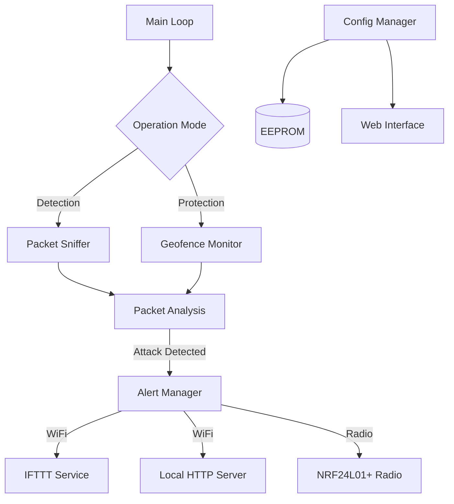

# System Patterns

## Architecture
The system follows a modular embedded architecture centered around the Arduino framework on ESP8266.

## Key Components

### 1. Packet Capture (`lib/packet_capture`)
-   Uses ESP8266's promiscuous mode to capture raw 802.11 frames.
-   Callback function `sniffer_wifi_promiscuous_rx` processes management frames (Beacon, Deauth, Disassoc).
-   Filters packets based on type and extracts relevant info (MAC addresses, RSSI, SSID).

### 2. Attack Detection Logic
-   **Deauth/Disassoc**: Counts consecutive deauth frames. If threshold (`MAX_DEAUTH_PKT`) is breached, flags an attack.
-   **Evil Twin**: Compares the SSID of captured beacons with the protected SSID. If the SSID matches but the encryption/security settings or BSSID don't match the expected profile (e.g., an Open AP claiming to be the secure corporate network), it flags an attack.

### 3. Alert System (`lib/alerts`)
-   Abstracts the alerting mechanism.
-   **WiFi**: Connects to the configured AP and sends JSON payloads via HTTP POST.
-   **NRF24**: Uses `RF24` and `RF24Network` libraries to send structured data packets to a receiver node (useful if WiFi is jammed).
-   **Heartbeat**: Periodically sends a "I'm alive" signal.

### 4. Configuration (`lib/config`)
-   Stores settings in EEPROM.
-   Provides a Web UI (Captive Portal) when unconfigured or requested, allowing users to input WiFi credentials and API keys.

## Design Patterns
-   **State Machine**: The device switches between Config, Detection, and Protection states.
-   **Observer/Callback**: The packet sniffer relies on the promiscuous mode callback to react to incoming data asynchronously.
-   **Singleton-ish**: Global variables (like `sensor_config`, `pkt_info`) are used to share state across modules (common in embedded C++).
